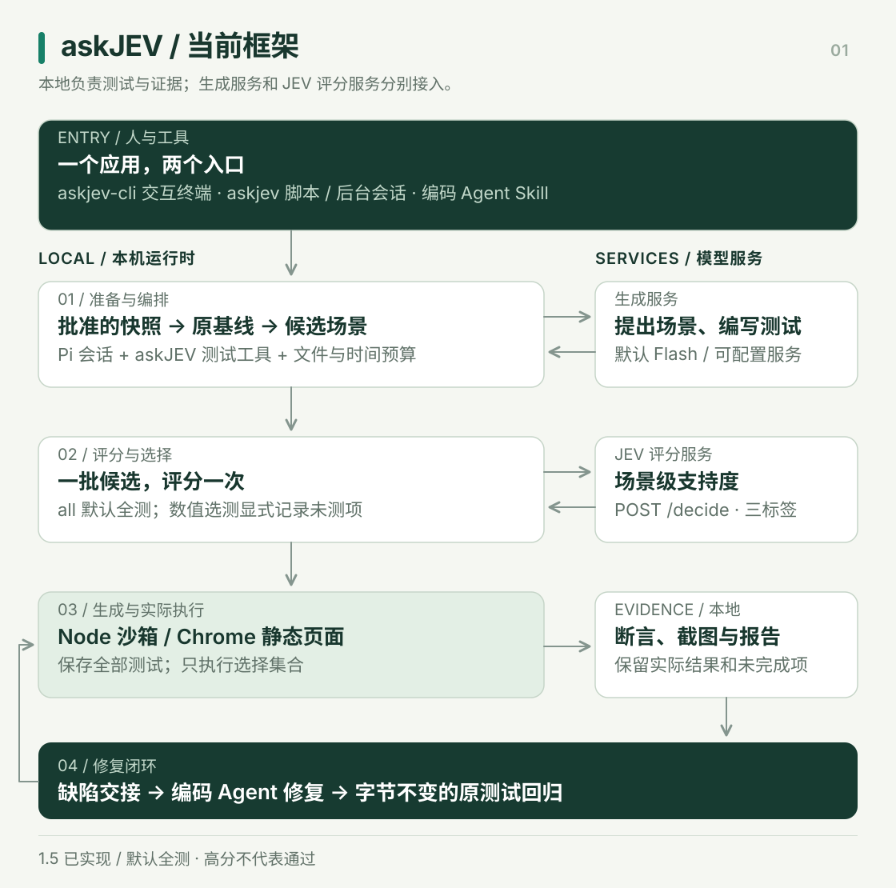

# askJEV Agent

**从用户要完成的事情出发，用真实测试定位代码问题，并用原测试验证修复。**

askJEV Agent 基于 Pi Agent 内核，把需求、源码快照、测试生成、JEV 评分、隔离执行和缺陷交接串成一个流程。你可以在终端中直接使用，也可以由编码 Agent 通过配套 Skill 调用。

当前版本 **1.5.0 · 工程试用版**。支持选定 JavaScript 模块与本地静态页面的 Chrome 功能测试。测试在本机执行，生成服务与评分服务独立配置。

[快速开始](#快速开始) · [当前架构](docs/framework.md) · [评分如何实现](docs/architecture/scoring-selection-v2.md#当前评分的实际实现) · [新测试流程设计](docs/architecture/scoring-selection-v2.md#目标流程先明确用户操作再测试) · [质量报告](docs/quality-review-2026-09-23.md)

## 能做什么

| 能力 | 当前行为 |
| --- | --- |
| 交互终端 | `askjev-cli` 打开 askJEV 对话界面，显示测试进度、结果与报告路径；模型由配置固定 |
| 测试与取证 | 按任务授权读取源码和需求，生成 Node 测试或浏览器操作计划，记录实际断言、输出与截图 |
| 评分与选测 | JEV 提供场景级支持度；默认执行全部候选，显式选测会列出未测试项 |
| 多轮与后台 | `campaign` 在总预算内分轮补查并复现失败；`session` 管理后台任务和持久对话 |
| 修复闭环 | 向编码 Agent 交接缺陷；修复后复用字节不变的原测试回归，并记录反馈 |

## 快速开始

### 1. 安装一次，使用两个入口

需要 **Node.js ≥22.19 与 npm**。当前本地执行器支持 macOS；浏览器测试还需要已安装的 Google Chrome。安装包不含模型凭据、Node 或 Chrome。

从本仓库构建并全局安装 CLI：

```bash
npm ci --ignore-scripts
npm run package:skill
npm install -g --ignore-scripts ./artifacts/releases/403-forbidden-askjev-agent-1.5.0.tgz
askjev-cli --version
```

若由编码 Agent 使用，选择[独立 Skill 安装方式](docs/skill-installation.md)：解压生成的 `askjev-agent-skill-1.5.0.tar.gz`，执行其中的 `scripts/install.mjs`。该方式自带匹配版本的私有运行库，无需再全局安装一份。安装包目前由源码构建，尚未发布到 npm registry。

`askjev-cli` 是面向人的终端界面，`askjev` 是输出 JSON 的脚本入口；两者属于同一应用。`pi` 是独立的通用助手，`pi-web` 是其网页入口，安装 askJEV 无需另外安装它们。[本机入口与目录整理](docs/local-installation.md)

### 2. 配置已有模型服务

```bash
askjev init
# 在 ~/.askjev-agent/config.json 填写服务地址与凭据引用
askjev doctor --probe --model flash-direct
askjev doctor --browser
```

私有 Skill 安装使用 `node ~/.codex/skills/askjev-agent/scripts/askjev.mjs` 代替上述 `askjev`；自定义技能位置以安装回执为准。已有配置会保留，`init` 拒绝覆盖。仅在私密配置要求 SSH 转发时先运行 `askjev connect start`；服务可直接访问时无需这一步。

生成服务负责提出场景、写测试与分析结果；JEV 服务负责评分。默认模型别名为 `flash-direct`，必须在私密配置中存在。连接示例见[通用配置](config/agent.example.json)与 [Spark 配置](config/spark.example.json)。凭据使用环境变量或私密文件引用，不能写进任务或仓库。

### 3. 打开终端，运行第一个任务

```bash
askjev example --directory /absolute/path/to/new-demo
askjev-cli
```

进入后输入：

```text
/run /absolute/path/to/new-demo/task.json
```

示例包含预置缺陷，发现问题是预期结果。也可直接输入“请检查这个 task.json”。`/help` 查看命令，`/report` 查看最近结果，Esc 取消任务，空输入框下 Ctrl+D 退出。

终端只使用私密配置中的默认模型，没有模型菜单或切换快捷键；任务文件的 `model` 不能覆盖它。脚本 `askjev run --model <alias>` 保留模型选项。每次打开终端是新对话，测试证据持续保存在本机。[完整 CLI 说明](docs/cli.md)

## 当前框架结构



本地负责范围校验、不可变快照、执行与证据。Pi 提供 Agent 会话及工具调用能力，askJEV 在其上定义测试工具和流程。远端模型不直接执行本机命令；Node 测试进入 macOS 沙箱，浏览器按批准的静态资源和受限操作计划运行。

当前不是一个网页前后端系统：面向用户的前端是终端，业务后端是本地测试运行时，生成与评分是独立服务。组件与源码对应关系见[框架说明](docs/framework.md)。

## 现在如何评分

每个候选场景包含操作、预期、需求原文和源码引用。Pi 将整批候选交给 `askJEV` 工具；适配器把相关源码和问题发到评分服务的 `POST /decide`。

JEV 对每个场景回答：“实现是否满足这个预期？”候选答案为 `supported`（满足）、`violated`（违反）、`unknown`（信息不足）。已核对的服务使用 Qwen3-4B-Instruct-2507，读取下一答案标签的 logits，经 softmax 得到三个标签之间的相对支持度；客户端取 `P(supported)` 作为分数，信息不足或无效结果保留为 `null`。

**评分在生成测试代码之前，每批一次。** 它针对待测业务实现与具体场景，不是整个项目的综合评分，也不是生成的测试代码质量分。网络失败重试不属于第二次独立评估。完整计算示例、输入字段和源码位置见[评分实现说明](docs/architecture/scoring-selection-v2.md#当前评分的实际实现)。

高分仍可能有缺陷：2026-09-23 浏览器样例的六项支持度都是 1.0，实际执行发现两项失败。因此默认 `all` 全测；分数用于实验排序，不等于操作频率、正确率或已校准的缺陷概率。`lowest/highest/range` 是显式预算选择，未测项不能写成通过。[原始验收摘要](docs/evidence/quality-review-2026-09-23.json)

## 下一步设计：从最少操作展开

**以下是目标设计，尚未接入 1.5 运行时。本次更新文档与图示，不改变现有评分或选测。**


1. **先明确任务。** 从代码或页面理解功能，向用户补齐尚不明确的目标：最少做哪些操作算完成？最多需要支持哪些选项、次数或顺序？已有需求能回答的部分直接复用。
2. **先测最短成功路径。** 从明确的初始状态完成用户目标，建立可观察的结果。例如默认数量与配送方式下的价格显示。
3. **扩展少见路径。** 围绕该路径增加省略、重复、撤回、顺序变化、边界值与状态组合。这里只产生“可能发生、尚未覆盖”的操作假设，不能仅凭模型分数判断真实用户很少操作什么。
4. **用两个视角评估同一证据。** 第一轮核对需求是否被满足，第二轮在不看首轮结论的情况下检查反例、边界和遗漏条件。两轮相同高分仍保留实际测试；有分歧则明确记录并优先验证。
5. **用执行反馈改进。** 记录失败复现、断言复核和修复后原测试结果，再比较两轮评分是否提高检出能力、是否值得额外时间。可靠性提升要靠保留集评估，不能靠多调用一次来宣称完成。

用户所说的“最多”，在设计中区分业务允许的范围与本轮探索预算；不要求枚举无限操作序列。最少操作是基线，不替代异常场景。问答由 askJEV 对话层负责，JEV 是后台评分组件。[完整设计与验收条件](docs/architecture/scoring-selection-v2.md)

## 实际测试与修复

```bash
askjev run --request <task.json> --select all
askjev handoff --from <run-directory>
# 编码 Agent 核对需求、证据并修改业务代码
askjev regress --from <run-directory> --project <fixed-checkout>
askjev feedback --from <run-directory> --regression <regression-directory>
```

任务必须列明允许读取的文件、需求和预算。`regress` 对新源码执行全部保存的原测试；`replay` 则使用原快照、原分数与原测试比较选测策略，不能用于验证修复。结果路径由 `artifacts.directory` 返回。[任务格式](docs/mvp/configuration.md) · [浏览器测试](docs/frontend-testing.md)

需要持续补查时使用 `campaign --rounds 3 --max-seconds 600 --max-model-turns 60`；需要后台执行时使用 `session run` 或 `session campaign`。评分故障默认严格失败，显式 `--scoring-failure all` 仅允许在全量策略下继续，并保留缺失评分。提交后台任务成功不代表测试通过。[持续测试](docs/campaigns.md) · [会话管理](docs/sessions.md)

## 验证与适用范围

2026-09-23 的发布验证如下。数字对应所列版本和样本，后续设计尚未计入。

| 验证 | 结果 |
| --- | --- |
| Agent 与终端 | 51 项检查通过；`src` 行覆盖率 94.30%，分支 78.44% |
| 模型 API 代理 | 36 项检查通过；行覆盖率 94.91%，严格类型与静态检查通过 |
| 两个受控样例 | JavaScript 8 项、浏览器 6 项，各检出两个预置缺陷；修复版原测试 8/8、6/6 通过 |
| 真实仓库 klona | 历史验证找到一类 DataView 克隆缺陷；修复后 16 组原测试通过，上游基线 137/137 |

支持范围为选定 JavaScript 模块和本地静态页面；生成模型可见源码与需求合计最多 16 KB，快照最多 512 KB，评分服务历史核对上限为 4096 tokens。暂不支持任意生产网址、登录/支付流程、通用后端 API、视觉差异测试、Linux 沙箱或步骤级断点恢复。双轮评估、自动最少/最多操作问答、独立复核与校准仍属设计。

目前没有多仓库盲测证明检错准确率、漏报率或评分收益。GPU 推理调优、模型权重训练和评分概率校准是不同工作；当前没有项目自行训练 JEV 权重的验证记录。Spark 承担评分与可选自托管生成，默认外部 Flash 生成不能计为本机 CUDA 加速。[质量报告](docs/quality-review-2026-09-23.md) · [NVIDIA 技术与证据](docs/architecture/nvidia-stack.md)

## 文档导航

| 主题 | 入口 |
| --- | --- |
| 安装与本机入口 | [Skill 安装](docs/skill-installation.md) · [目录与重复安装整理](docs/local-installation.md) |
| 当前实现 | [框架](docs/framework.md) · [CLI](docs/cli.md) · [组件来源](THIRD_PARTY_NOTICES.md) |
| 评分与未来设计 | [评分机制和用户操作设计](docs/architecture/scoring-selection-v2.md) · [能力路线](docs/diagnostic-roadmap.md) |
| 证据与历史 | [公开质量报告](docs/quality-review-2026-09-23.md) · [真实仓库评估](docs/mvp/github-evaluation.md) · [改动记录](CHANGELOG.md) |

公开仓库：[appergb/askjev-pi-test-agent](https://github.com/appergb/askjev-pi-test-agent)。私密配置、会话、原始日志和凭据不随源码或安装包发布。
