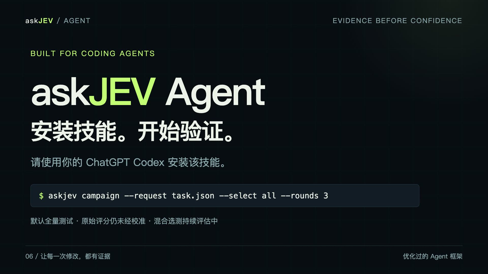
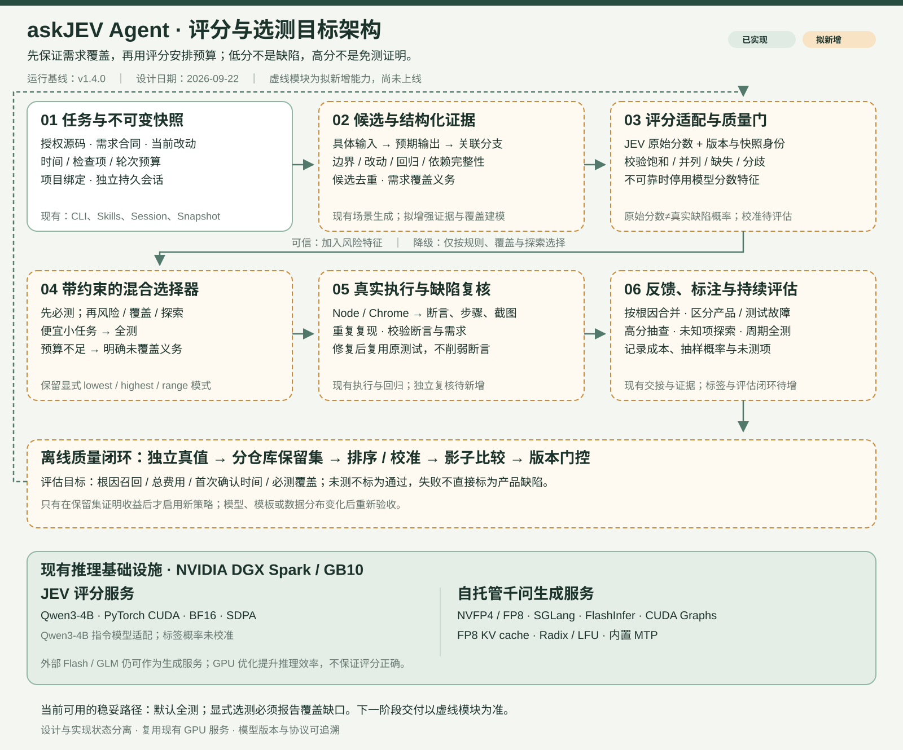

# askJEV Agent

**面向代码测试与问题排查的优化过的 Agent 框架。** 编码 Agent 通过独立 Skill 调用 CLI，由测试 Agent 生成并执行测试，保存复现证据，交接缺陷，并验证修复。

当前版本 **1.5.0，工程试用阶段**。支持明确授权的 JavaScript 模块与本地静态前端 Chrome 功能测试。测试在本地执行，云端提供生成与评分服务。

[安装技能](docs/skill-installation.md) · [CLI](docs/cli.md) · [会话管理](docs/sessions.md) · [持续自动测试](docs/campaigns.md) · [介绍视频](video/README.md) · [评分架构设计](docs/architecture/scoring-selection-v2.md) · [NVIDIA 技术清单](docs/architecture/nvidia-stack.md)

[](video/README.md)

## 使用你的 ChatGPT Codex 安装

**请使用你的 ChatGPT Codex 安装该技能。** 将独立安装包 `askjev-agent-skill-1.5.0.tar.gz` 交给具备本地文件和终端能力的编码 Agent：

> 请安装我提供的 askjev-agent 技能包，阅读 SKILL.md 并运行 scripts/install.mjs，安装配套 CLI、运行库与内置 Skills，保留已有私密配置并验证连接。之后测试本项目时，由技能管理独立会话、调用 CLI、读取实际失败证据，修复后执行原测试回归。不要把密钥写进仓库。

安装器校验随包携带的固定版本 CLI；技能通过自己的调用脚本使用匹配版本。普通聊天界面若没有本地执行能力，无法安装本机程序。Node.js、Chrome 和模型凭据不包含在包中，依赖下载需要网络。

从本仓库根目录制作安装包：

```bash
npm ci --ignore-scripts
npm run package:skill
```

包输出到 `artifacts/releases/`。解压后安装：

```bash
node askjev-agent/scripts/install.mjs
node ~/.codex/skills/askjev-agent/scripts/askjev.mjs --version
```

支持 CODEX_HOME、自定义技能目录与安装目录，不覆盖无关技能、不修改 shell 配置。[完整安装说明](docs/skill-installation.md)

## 连接模型与 DGX Spark

以下命令使用已安装的 `askjev`；通过技能使用时，由技能的调用脚本执行同样参数。

```bash
askjev init
# 填写 ~/.askjev-agent/config.json 中的服务地址与凭据引用
askjev connect start
askjev doctor --probe --model flash-direct
askjev doctor --browser
```

生成服务与评分服务独立配置；直接可达的服务可省略 SSH 连接步骤。既有模型别名为 `flash-direct`、`glm`、`qwen-cloud`，其他环境按实际部署填写。配置样例均为占位值：[通用模型](config/agent.example.json)、[Spark 接入](config/spark.example.json)。

默认数据目录为 `~/.askjev-agent`，支持 `ASKJEV_HOME`、`ASKJEV_CONFIG` 和 `--config`。密钥只通过环境变量或明确引用的私密文件读取。

## 测试与修复闭环

```text
任务与需求 → 源码快照 → 原测试基线 → 场景生成 → askJEV 评分
    → 按策略执行 → 断言与截图证据 → 编码 Agent 修复 → 原测试回归
```

```bash
askjev run --request <task.json>
askjev handoff --from <run-directory>
askjev regress --from <run-directory> --project <fixed-checkout>
askjev feedback --from <run-directory> --regression <regression-directory>
```

任务明确列出允许读取的源码、需求和预算。测试 Agent 生成测试，编码 Agent 修改业务实现。回归保留原测试字节，不复用旧源码评分。结果中的 `artifacts.directory` 指向证据目录；交接报告由调用方读取。

## 持续自动测试

```bash
askjev campaign --request <task.json> --select all --scoring-failure all \
  --rounds 3 --max-seconds 600 --max-model-turns 60
```

固定同一份源码快照，分轮生成与执行测试，把已测场景和未引用的需求交给下一轮；出现失败时自动用原测试复现。总时间、轮数和模型调用轮次有上限，连续没有新测试内容时提前停止。每轮结果、复现证据及汇总交接持续写入本地目录。

需要离开前台时，用 `session campaign --id <id> --request <task.json> --rounds 3` 在后台运行，再用 `session inspect/logs/stop` 管理。每轮使用独立模型对话，避免把历史结果当作本轮证据。它不是无限循环，也没有崩溃后步骤续跑。[完整说明](docs/campaigns.md)

## 独立会话与并行任务

```bash
askjev session create --name frontend --count 2
askjev session run --id <id> --request <task.json>
askjev session inspect --id <id>
askjev session logs --id <id>
askjev session stop --id <id>
askjev session clear --id <id>
askjev session restart --id <id>
```

同一会话保留模型历史，不同会话独立运行。同一会话禁止重叠任务。清空删除对话上下文，保留测试证据；重开会重新提交任务。后台提交成功不代表测试通过，需要等待实际结果。这是应用层生命周期管理，尚无 Docker 级系统隔离或资源配额。

## 评分筛选：当前能力与下一步

**当前默认全测。评分是辅助信号，不是用户操作概率，也不是软件正确率。** 显式选测可用于预算实验：

```bash
askjev run --request examples/frontend-shop/task.json --select lowest --count 3
askjev replay --from <run-directory> --select all
```

也支持最高分前 N 项和分数区间；未选中项明确标为未测试。`replay` 比较冻结源码、分数与测试，不用于验证修复。

现有 JEV 读取下一答案标签的条件概率，尚未校准为缺陷概率。购物结算实验中，优惠码错误得到约 `0.00247` 的低分，免运费边界错误却得到 `1.0`；只测低分会漏检。后续复测只测一项也曾未检出预置缺陷。[实验记录](docs/evidence/frontend-1.3.json)

1.5 已增加评分饱和、并列与未知项诊断，保存为 `score-quality.json`。诊断用于暴露问题，不会把分数变成可靠置信度。`--scoring-failure all` 允许评分服务失败后继续全量测试，缺失评分保持 null；只在 `--select all` 下启用，严格选测不会被暗中扩大。默认错误策略仍为 strict。

**后续设计，尚未实现：**

- 小任务优先全测，避免评分成本超过省下的执行成本。
- 引入需求边界、改动影响与历史回归的必测集合。
- 使用风险、覆盖增益和分层探索共同选择，保留高分与未知项抽查。
- 在现有饱和/并列诊断上增加上下文与模型分歧检查，并与混合选择器联动。
- 建立根因级真值和多仓库评估，达到门槛后才引入学习排序与概率校准。



[完整架构设计](docs/architecture/scoring-selection-v2.md) · [下载 SVG](docs/architecture/scoring-selection-v2.svg)

## NVIDIA CUDA 与模型推理调优

**JEV 是基于经过后训练的 Qwen3-4B 系列指令模型构建、面向测试场景适配的决策评分模型。** 它结合需求、源码与候选检查项输出评分信号，为测试优先级安排提供依据。

针对 **NVIDIA DGX Spark / GB10**，JEV 与千问服务已完成部署适配和推理参数调优。

| 路径 | 已使用的技术 | 项目工作 |
| --- | --- | --- |
| JEV 评分 | Qwen3-4B 指令后训练版本、PyTorch CUDA、BF16、SDPA | GPU 部署、版本固定、评分协议与测试联调 |
| 千问生成 | 混合 NVFP4/FP8 checkpoint、SGLang、FlashInfer | 单机服务接入、工具调用及推理参数适配 |
| 生成性能 | CUDA Graphs、FP8 KV cache、Radix/LFU 前缀缓存、模型内置 MTP | 图捕获与缓存路径验收、交互延迟和吞吐取舍 |
| 单机资源 | 内存比例、分块预填充、Mamba 状态与调度配置 | 为评分和生成服务共存保留资源 |

JEV 当前使用 `Qwen3-4B-Instruct-2507`，其基础模型经历预训练与后训练，详见 [模型说明](https://huggingface.co/Qwen/Qwen3-4B-Instruct-2507)。评分服务已核实采用 CUDA/BF16；标签概率尚未校准为缺陷概率。千问生成服务采用混合 NVFP4/FP8 权重，结合缓存与推测解码优化推理效率。

CUDA Graphs 用于减少重复 GPU 工作提交开销，原理见 [NVIDIA 文档](https://docs.nvidia.com/cuda/cuda-programming-guide/04-special-topics/cuda-graphs.html)。它和缓存优化提升的是推理效率，不保证评分判断正确。Flash/GLM 外部 API 与本机 Chrome 测试不计入 Spark CUDA 加速的证明。

部署参数与历史性能观测见 [技术清单](docs/architecture/nvidia-stack.md)。测试框架通过现有私密连接调用服务；云端部署参数单独管理。

## 验证与当前边界

- **1.5：47 项检查通过。** 真实后台任务计划最多五轮，在第三轮因连续没有新测试内容自动停止；三轮共执行 18 项、复现执行 18 项。六条失败记录对应两个已复核的预置缺陷；修复版原测试通过。新增评分异常显式降级与质量诊断。[运行证据](docs/evidence/campaign-1.5.json)
- **1.4：39 项基础设施检查通过**；独立技能自安装、两个真实后台会话、历史上下文恢复与清空均已验证。[记录](docs/evidence/skill-session-1.4.json)
- **前端样例：** 全量六项发现两个预置缺陷，修复后原测试 6/6 通过；这不是外部工程的盲测结果。
- **真实仓库 klona：** 找到 DataView 克隆的一类缺陷，修复后 16 组原生成测试通过；原版和修复版上游测试均为 137/137。[记录](docs/evidence/klona-1.1.json)

当前支持选定 JavaScript 模块和本地静态前端；模型可见输入 16 KB、快照 512 KB。评分服务 4096-token 上限与生成服务的长上下文能力分开管理。尚不支持生产网站、支付/登录流程、后端 API、视觉差异测试或执行步骤断点恢复。新架构中的 hybrid、独立复核、根因自动去重与校准训练仍是待实现能力。持续任务已有失败重现，尚不能独立证明断言符合业务需求。

业务命令输出 JSON；退出码为 0 成功无确认问题、1 完成且有问题、2 输入/配置无效、3 失败、4 不完整、5 取消。局部通过不等于软件没有 bug。

[改动记录](CHANGELOG.md) · [后续能力路线](docs/diagnostic-roadmap.md) · [组件来源说明](THIRD_PARTY_NOTICES.md)
