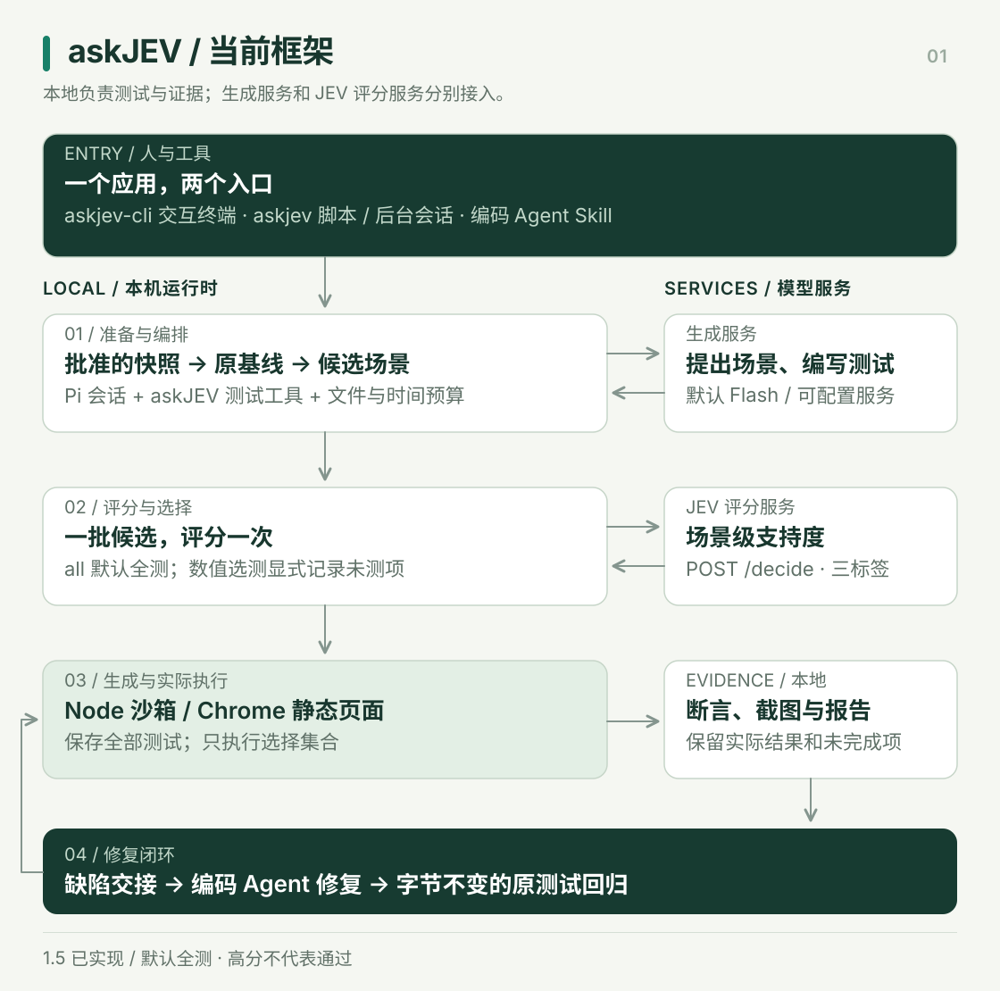
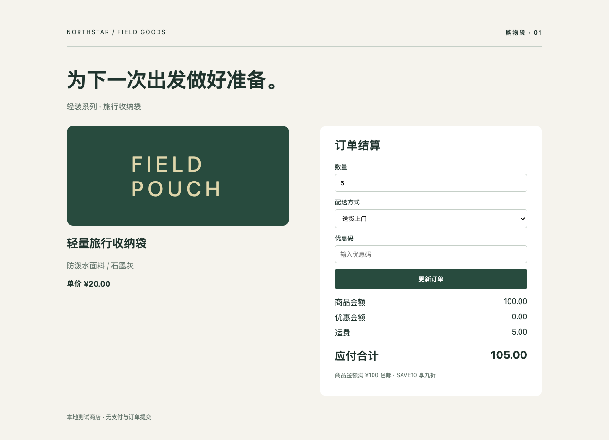
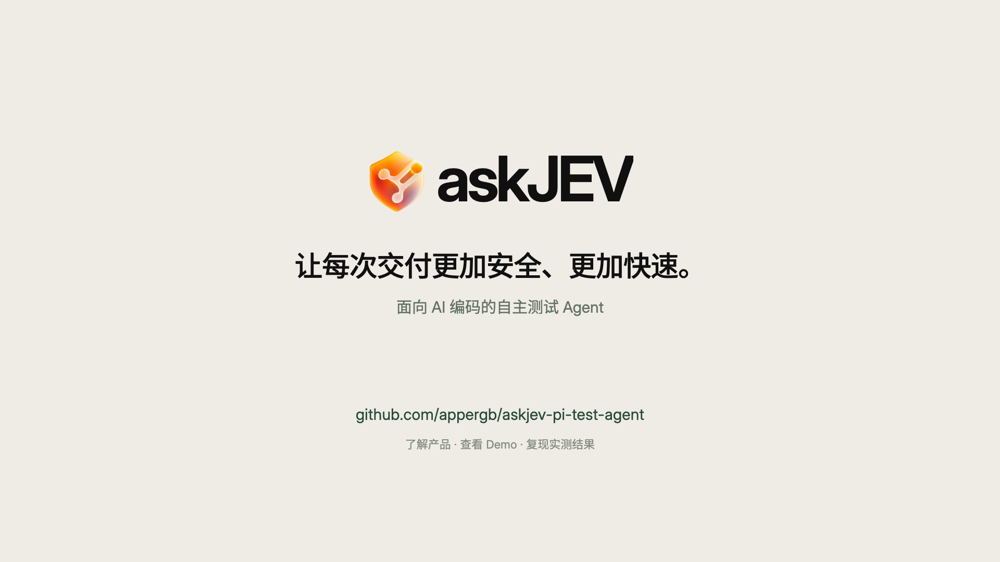

# askJEV Agent

**面向 AI 编码的自主测试 Agent，让软件交付拥有可复现的质量证据。**

[](https://github.com/appergb/askjev-pi-test-agent/actions/workflows/quality.yml)

**1.5.0 · 工程试用版** ｜ NVIDIA DGX Spark ｜ JavaScript 与本地静态前端 ｜ 业务验证更新至 2026-09-25

askJEV Agent 将需求理解、测试生成、GPU 评分、真实执行和修复回归连接成一套工作流。开发者提供批准的代码与需求，Agent 自动构建测试场景，在 Node 或 Chrome 中验证实际行为，再把需求依据、失败断言和复现材料交给编码 Agent。修复后，同一批原测试再次执行，形成可以检查的交付结果。

我们的目标是成为 **AI 编码工作流中的测试与验收基础设施**：让开发者更容易回答“哪里有问题、依据是什么、修复是否有效”，并让测试经验沉淀为下一次开发可以继续使用的证据。

**需求与代码 → 场景生成 → JEV 评分 → Node / Chrome 执行 → 缺陷交接 → 编码 Agent 修复 → 原测试回归**

[产品价值](#产品价值) · [主要功能](#主要功能) · [实现原理](#实现原理) · [DGX Spark 技术](#nvidia-dgx-spark-技术应用) · [实测成果](#实测成果) · [Demo 演示](#三分钟-demo) · [下一版本](#下一版本规划) · [快速开始](#快速开始)

## 成果速览

| 已验证成果 | 具体结果 | 核查入口 |
| --- | --- | --- |
| 真实开源仓库缺陷发现 | klona 2.0.6 边界专项发现 DataView 克隆缺陷；修复后 16 组原 Pi 测试通过，上游基线 137/137 通过 | [真实仓库评估](docs/mvp/github-evaluation.md) |
| JavaScript 与前端测试闭环 | 两个受控样例共执行 14 项测试，检出 4 个预置缺陷；修复版原测试 14/14 通过，测试文件逐字节不变 | [2026-09-25 验收](docs/evidence/capability-review-2026-09-25.json) |
| Spark 自托管模型联调 | Spark 生成模型与 JEV 评分共同完成 8 项 Node 测试，检出 2 个预置缺陷，修复版原测试 8/8 通过 | [GPU 联调证据](docs/evidence/spark-tuning-2026-09-23.json) |
| GPU 推理部署调优 | 指定 32K 输入下，DSpark 冷解码三轮中位数 38.12 token/s，较原配置单次 27.06 token/s 约高 41% | [测量与条件](#推理调优的实际结果) |
| 工程交付 | 51/51 本地自动检查通过；具备终端、独立 CLI、配套 Skill、后台会话和持续测试任务 | [能力与技能](docs/testing-capabilities.md) |

这些结果分别来自真实仓库专项、受控业务样例和固定推理负载。它们证明核心流程已跑通，也为扩大项目范围与优化成本提供了可复核的起点。

## 产品价值

### 将业务要求转化为可执行的验收

“数量最多为 10”“满 100 免运费”“重复请求不能重复创建”都是很短的需求，却容易在边界条件和重复操作中实现错误。askJEV 把文字要求关联到具体源码，生成场景与断言，再实际运行检查。开发者拿到的是对应需求的测试结果和复现材料。

这一流程适合代码修改频繁、使用编码 Agent、又需要核对业务行为的小团队。它能够补充现有测试中的边界检查，并把发现的问题交回正在实现功能的编码 Agent。

### 把一次发现变成可复用的修复依据

每次运行都保存代码快照、测试内容与执行证据。`handoff` 将问题整理成编码 Agent 可消费的交接文件；`regress` 在修复代码上重新执行保存的原测试；`feedback` 记录闭环结果。测试内容摘要和字节一致性校验，让评审者能够核对修复前后使用的是同一套检查。

这让“发现问题”进一步变成“推动问题被修复”，也为持续积累业务回归测试提供了基础。

### 为不同使用者提供同一个测试运行时

| 使用者 | 当前入口 | 获得的价值 |
| --- | --- | --- |
| 独立开发者与小型团队 | `askjev-cli` 终端 | 查看测试进度、问题报告和证据位置，缩短从需求到首次验证的操作链路 |
| 使用编码 Agent 的开发者 | `askjev-agent` Skill | 将测试委派、缺陷读取和原测试回归接入编码过程 |
| 需要脚本编排的团队 | `askjev` JSON CLI | 用结构化结果连接现有工具，管理后台会话和预算内多轮任务 |
| 评估自托管推理的团队 | DGX Spark 生成与评分路径 | 在自有算力上验证模型调用、工具协议和业务测试协同 |

## 主要功能

| 功能 | 当前如何工作 | 交付内容 |
| --- | --- | --- |
| 需求驱动的场景生成 | 读取批准的代码与需求，提出正常、边界、非法输入与重复操作场景 | 带需求原文和源码引用的候选场景 |
| JavaScript 模块测试 | Pi 编写 `node:test`，执行器实际运行；支持明确配置的 `node:test` / `uvu` 原基线 | 断言、真实输出与逐项结果 |
| Chrome 前端功能测试 | 对本地静态快照执行点击、输入、选择和 DOM 断言，每例使用新的页面状态 | 操作计划、失败断言及截图 |
| JEV 评分与选测 | 对候选预期进行支持度评估；默认 `all`，支持显式 `lowest` / `highest` / `range` | 分数、选择集合、未测项和质量诊断 |
| 冻结快照重放 | `replay` 复用同一源码、同一测试与已有分数比较选测策略 | 可比较的执行结果 |
| 缺陷交接与修复回归 | `handoff → regress → feedback`，修复由编码 Agent 完成 | 需求依据、复现证据和原测试回归结果 |
| 持续测试 campaign | 在总时间、轮数和模型调用预算内分轮补查，失败用原测试重现 | 每轮证据、汇总交接和停止原因 |
| 后台会话 session | 独立持久对话、后台任务、查询、取消、清空与重开 | 独立会话状态和保留的测试证据 |
| 独立安装与诊断 | 固定版本运行库、配套 Skill、健康检查和真实工具调用探测 | 可复现安装、版本信息和分项诊断 |

1.5 的重点是把单轮测试扩展为**有预算、有过程记录、可追踪停止原因的持续任务**。当前交互终端与脚本入口共享运行时，既支持人在终端操作，也支持其他 Agent 调用。[持续任务](docs/campaigns.md) · [会话管理](docs/sessions.md) · [CLI](docs/cli.md)

## 实现原理



### 三层协同

**交互层**提供 `askjev-cli`、`askjev` 和编码 Agent Skill。终端显示中文对话、执行进度和报告；脚本入口输出 JSON。终端固定使用私密配置的默认模型，脚本入口保留模型配置选项。

**编排与执行层**运行在本地 macOS。Pi SDK 管理模型会话与工具调用，askJEV 负责范围检查、源码快照、预算、测试执行及证据保存。Node 执行器限制网络、非批准路径访问和业务源码写入；Chrome 使用受限静态资源和独立页面状态。

**模型服务层**负责场景生成、测试编写和 JEV 评分。默认业务验证使用外部 Flash 生成服务与 Spark 上的 JEV；另一条已验证路径由 Spark 同时承载自托管千问生成与 JEV 评分。本地 Node / Chrome 执行器完成行为验证。

### 从输入到修复的八个步骤

| 步骤 | 实现方式 | 关键源码或产物 |
| --- | --- | --- |
| 1 验证任务 | 检查源码范围、依赖、需求和预算，冻结输入代码 | [common.mjs](src/common.mjs)、`snapshot.json` |
| 2 检查原基线 | 执行已配置的原测试；已有失败先阻断新缺陷发现 | [baseline.mjs](src/baseline.mjs)、`baseline.json` |
| 3 构建候选 | 读取批准快照，提出带需求依据的场景 | [model.mjs](src/model.mjs)、[runner.mjs](src/runner.mjs) |
| 4 执行评分 | 提交相关业务源码和候选预期，校验返回 ID 与概率字段 | [scoring.mjs](src/scoring.mjs)、`scores.json` |
| 5 保存测试 | 编写 Node 测试或浏览器计划，程序确定选测集合 | [selection.mjs](src/selection.mjs)、`tests.json` |
| 6 真实执行 | 在 Node / Chrome 中运行，记录通过、失败和环境问题 | [execution.mjs](src/execution.mjs)、[browser.mjs](src/browser.mjs)、`evidence/` |
| 7 形成交接 | 关联需求原文、失败断言、快照身份和测试摘要 | [handoff.mjs](src/handoff.mjs)、`coding-handoff.json` |
| 8 原测试回归 | 对修复代码建立新快照，执行字节不变的原测试并保存反馈 | `regress`、`feedback`、`coding-feedback.json` |

### 五个内置技能

`brainstorming` 提出测试场景；`ask-jev` 组织评分输入；`writing-tests` 编写并执行测试；`browser-tests` 生成受限页面操作；`bugs` 结合需求与真实执行结果分析问题。Node 任务加载四个通用技能，浏览器任务追加 `browser-tests`，运行记录保存加载文件的 SHA-256。[技能职责](docs/testing-capabilities.md#五个内置测试技能)

技能约束模型的工作方式，快照保护、预算和证据一致性由程序执行。测试 Agent 不能通过改写业务代码或放宽失败断言来让测试通过。

### 项目的工程贡献

我们基于 **Pi 0.85.1** 的会话、模型与终端组件，构建了需求关联的测试协议、受控执行工具、评分适配、失败分类、持续任务以及编码 Agent 交接与回归流程。Open JEV 和已有模型提供推理能力，Playwright / Chrome 提供浏览器执行能力；项目将这些组件组织成可运行、可诊断、可复现的测试产品。[框架说明](docs/framework.md) · [上游组件来源](THIRD_PARTY_NOTICES.md)

## NVIDIA DGX Spark 技术应用

### Spark 在产品中的位置

我们使用的设备是 **NVIDIA DGX Spark**，基于 **GB10 Grace Blackwell** 和 **128 GB 统一内存**。硬件规格见 [NVIDIA 官方说明](https://www.nvidia.com/en-us/products/workstations/dgx-spark/)。项目利用它承载 JEV 评分和可选的自托管生成服务，将 GPU 推理连接到实际的软件测试流程。

本地开发环境负责源码和测试执行，Spark 负责模型推理。对希望控制模型版本、调用路径与算力配置的团队，它提供了一条已经完成业务联调的自托管路径；默认外部 API 模式与自托管模式分别配置。

### 已使用的技术及其作用

| 技术或组件 | 项目中的具体用法 | 实现价值 |
| --- | --- | --- |
| GB10 GPU / CUDA 13.0 | 承载 JEV 及自托管生成模型的 GPU 推理 | 将模型服务接入测试 Agent 的工具调用流程 |
| PyTorch CUDA / BF16 / SDPA | JEV 基于 Qwen3-4B-Instruct-2507，使用 GPU 与 BF16 推理 | 为候选场景提供支持度分布，支撑评分与选测实验 |
| NVIDIA 混合 NVFP4 / FP8 checkpoint | 自托管生成使用 `nvidia/Qwen3.8-27B-NVFP4` 预量化权重 | 降低权重存储需求，适配已验证的 GB10 推理路径 |
| SGLang 0.5.19 | 部署生成服务，组织请求、缓存、推测解码和工具调用解析 | 向 Agent 提供可调用的生成接口 |
| FlashInfer | 配置生成及草稿注意力计算后端 | 支撑 GPU 注意力计算；与外部 Flash 生成 API 是不同组件 |
| FP8 E4M3 KV cache | 低精度注意力缓存，结合上下文与全局容量配置 | 控制长输入和多请求的缓存占用 |
| CUDA Graphs | 已有启动记录包含图捕获 | 减少重复 GPU 工作的提交开销，实际收益随负载变化 |
| Radix Cache / LFU | 复用系统提示、工具 schema 和相同资料前缀 | 减少重复长输入的首 Token 等待 |
| DSpark 推测解码 | 2026-09-23 验证独立草稿模型与目标模型协同，替换该轮原 MTP 配置 | 在指定低并发负载下提高持续解码速度 |
| 固定内存池与分块预填充 | 协调 KV、Mamba 状态和同机 JEV 的资源需求 | 让配置容量、实际容量与交互负载相匹配 |
| Docker GPU 容器 | 固定运行环境、模型 revision 和镜像摘要 | 便于复现部署和比较候选配置 |

上述工作属于**部署适配、推理调优与业务联调**。我们使用已有模型和社区推理组件，当前没有本项目自行训练模型权重的验证记录。技术机制与较早基线见 [NVIDIA 技术说明](docs/architecture/nvidia-stack.md)；更新后的 DSpark 配置、测量和联调以 [2026-09-23 脱敏证据](docs/evidence/spark-tuning-2026-09-23.json)为准。

### 推理调优的实际结果

2026-09-23，固定目标模型 revision 与 SGLang / CUDA 版本，测试 DSpark 加固定内存池的交互配置。4K / 32K 各做三组冷热请求并取中位数，128K / 约 237K 各做一组；每个性能请求至少输出 1,024 个 Token。

| 实际输入 Token | 冷解码速度 | 重复输入热首 Token 时间 | 测量次数 |
| ---: | ---: | ---: | --- |
| 4,095 | **44.02 token/s** | **0.14 秒** | 三组，中位数 |
| 32,813 | **38.12 token/s** | **0.19 秒** | 三组，中位数 |
| 131,047 | **27.25 token/s** | **0.43 秒** | 一组 |
| 237,034 | **21.85 token/s** | **0.73 秒** | 一组 |

在这组固定任务中，32K 冷解码从原配置单次 **27.06 token/s** 提升到新配置三轮中位数 **38.12 token/s**，约高 **41%**。热缓存让上述重复输入的首 Token 等待低于一秒。新配置的生成进程 GPU 内存统计约为 **62.1 GiB**，较最初配置约低 **12.8 GiB**。

这些改善针对单路与低并发交互。该轮八路整组吞吐从 117.15 降至 109.50 token/s，冷长输入和长短请求混跑仍有等待；不能将解码提升解释为所有请求整体提速。性能输出与 JSON、工具调用、代码执行、长文档定位的功能验证分别记录。[完整测量](docs/evidence/spark-tuning-2026-09-23.json)

### 已完成自托管生成与评分的业务闭环

同一天，通过 `qwen-cloud` 让 Spark 生成模型和 Open JEV 共同测试 TaskStore：8 个用例全部执行，6 通过、2 失败，两个根因对应数量上限与幂等性。对已有修复版执行相同测试后 **8/8 通过**，反馈为 `regression_passed`。

这条记录把 GPU 部署与产品功能连接起来：模型需要正确调用工具、生成可执行测试，并配合本地执行器完成交接和回归。默认 Flash 模式的生成耗时单独计算，不计入 Spark 加速成果。[联调字段 `askjev_integration`](docs/evidence/spark-tuning-2026-09-23.json)

### 三值模型候选进展

2026-09-25，我们在 GB10 上复现并评估了基于社区 NInfer 与 PrismML `Ternary-Bonsai-2-27B` 的候选路径，完成 ARM64 / `sm_121a` 构建适配、权重装配核对、数值检查和工具调用验证。该候选的文本与 MTP 实际加载权重约 **7.12 GiB**；一组 4K 冷解码观测为 **58.55 token/s**；约 **237K Token** 的一次长文档检索与合并回答检查通过。

**这是已验证的候选方向，尚未切换生产。** 原 SGLang 服务在验证后恢复。候选目前缺少原服务的严格 JSON Schema、强制工具调用和优先级抢占，冷预填充也有取舍；后续按接口兼容性和端到端业务效果决定是否采用。[候选指标与恢复状态](docs/evidence/ninfer-ternary-2026-09-25.json)

## 实测成果

### 真实仓库发现了原测试未覆盖的边界

在固定版本的 **lukeed/klona 2.0.6** 上，边界专项发现克隆 `DataView` 时丢失 `byteOffset` 与 `byteLength`：原视图只覆盖缓冲区中的 4 字节，克隆结果却覆盖整个 8 字节。此仓库测试没有植入缺陷。

编码 Agent 核对证据后，在独立副本中修复两处实现；**16 组原 Pi 测试回归通过，上游基线在原版和修复版均为 137/137 通过**。这说明针对明确契约的边界测试可以补充原测试覆盖。三个失败记录归为一类缺陷；首轮通用测试未发现该问题，成果来自后续显式边界专项。[方法与固定提交](docs/mvp/github-evaluation.md) · [验收数据](docs/evidence/klona-1.1.json) · [修复补丁](examples/github-klona/dataview-fix.patch)

### 两类业务样例完成快速测试与回归

2026-09-25，使用真实生成模型与 JEV 服务，明确选择 `all`：

| 样例 | 原版结果 | 发现的预置缺陷 | 本次发现流程耗时 | 修复版原测试回归 |
| --- | --- | --- | ---: | --- |
| JavaScript TaskStore | 8 项，6 通过、2 失败 | 合法数量 10 被拒绝；相同请求重试产生重复记录 | **17.27 秒** | **8/8 通过** |
| Chrome 购物页面 | 6 项，4 通过、2 失败 | 恰好 100 未免运费；优惠券按 5% 而非 10% 折扣 | **21.97 秒** | **6/6 通过** |

**14 份生成测试在回归中逐字节不变，两个反馈状态均为 `regression_passed`。** 耗时为受控样例单次发现流程，不包含安装、配置和修复；它展示当前流程的响应速度，不代表未知项目的检错率或耗时保证。[完整验收](docs/evidence/capability-review-2026-09-25.json)

下面是该次 Chrome 执行保存的真实失败截图：商品金额已到 100.00，页面仍收取 5.00 运费。截图展示的是被测样例；askJEV 的交互入口为终端。



需求要求运费为 `0.00`，执行器记录的失败为 `ERR_ASSERTION #shipping: expected "0.00", actual "5.00"`。测试结果由页面实际行为支撑，修复后继续使用相同断言验证。

### 工程质量与持续任务

| 检查范围 | 记录 | 日期 |
| --- | --- | --- |
| Agent、终端、执行器、会话和 campaign | **51/51** 自动检查通过，无跳过 | 2026-09-25 |
| 本地运行时 `src` | 行覆盖率 **94.30%**，分支覆盖率 **78.44%** | 2026-09-23 |
| 模型 API 代理 | **36/36** 检查通过，行覆盖率 **94.91%**；严格类型与静态检查通过 | 2026-09-23 |
| campaign 真实模型验证 | 完成三轮浏览器任务及失败复现；六条缺陷记录归属两个已知根因 | 1.5 验收 |

自动检查与代码覆盖率衡量工程行为，模型检错效果需要另行评估。当前多仓库盲测、总体误报/漏报和评分节省成本尚未形成可报告结论。[质量报告](docs/quality-review-2026-09-23.md) · [持续任务证据](docs/evidence/campaign-1.5.json)

## 三分钟 Demo

[观看约 50 秒宣传片](video/exports/askjev-motion-1080p.mp4) · [查看可编辑工程](video/README.md)

[](video/exports/askjev-motion-1080p.mp4)

### 演示内容安排

演示主线使用已有购物样例，突出从需求到修复验证的完整过程。下表是建议录制与讲解节奏，现场等待以实际运行结果为准。

| 建议时间 | 画面与操作 | 讲解重点 |
| --- | --- | --- |
| 0:00–0:25 | 展示购物页和“满 100 免运费、SAVE10 九折”的需求 | 简单业务规则也可能隐藏边界和金额计算问题 |
| 0:25–1:05 | 启动 askJEV，展示场景生成、评分与 Chrome 执行进度 | Agent 把需求变成测试，并实际操作页面 |
| 1:05–1:40 | 展示失败报告、运费截图和需求引用 | 问题有预期、有实际值、有复现证据 |
| 1:40–2:25 | 展示交接，核对已有修复版，执行原测试回归 | 同一批检查验证修复，展示测试字节一致性 |
| 2:25–3:00 | 展示架构图、自托管联调和下一版目标 | Spark 推理已经连接到业务流程，后续扩大验证范围 |

### 可复现操作

完成[快速开始](#快速开始)后，在仓库根目录执行。该演示是包含已知缺陷的受控样例，修复阶段使用预先准备的修复版。

**1. 展示需求，运行全量测试。**

先打开[页面需求](examples/frontend-shop/requirements.md)与[业务代码](examples/frontend-shop/app.js)，再运行：

```bash
askjev doctor --browser --probe --model flash-direct
askjev run --request examples/frontend-shop/task.json --select all
```

示例原配置带选测设置，`--select all` 显式覆盖为全量执行。读取输出的 `run_status`、`statistics`、`scoring.backend_mode` 和 `artifacts.directory`。确认缺陷时退出码为 **1**，代表完成并发现问题；任务失败、取消或未完成需要按实际状态说明。

**2. 展示失败证据与交接。**

用返回的 `artifacts.directory` 替换 `<原运行目录>`：

```bash
askjev handoff --from "<原运行目录>"
```

打开该目录的 `report.md` 和 `evidence/`，展示免运费边界、优惠券断言与截图。编码 Agent 在实际开发中依据这份交接核对并修改业务实现。

**3. 对已有修复版执行同一批测试。**

```bash
askjev regress --from "<原运行目录>" --project examples/frontend-shop-fixed
askjev feedback --from "<原运行目录>" --regression "<回归目录>"
```

`<回归目录>` 来自 `regress` 返回的 `artifacts.directory`。展示 `tests_unchanged=true`、逐项回归结果及 `overall_status=regression_passed`。历史样例为 6/6 通过，新运行以当次证据为准。

若演示 Node 流程，使用 `examples/retry-demo/task.json` 和 `examples/retry-demo-fixed/`。若私密配置已包含 `qwen-cloud`，可在脚本入口用 `--model qwen-cloud` 演示 Spark 自托管生成与评分。`replay` 比较原快照的选测策略，修改后的代码使用 `regress`。[完整命令](docs/cli.md)

## 下一版本规划

下一阶段将测试组织方式推进到**围绕用户目标的行为探索**：先确认最少需要哪些操作才能成功，再扩展边界、重复、撤回和顺序变化，帮助开发者检查正常路径之外的业务状态。

| 阶段 | 计划建设 | 验收依据 |
| --- | --- | --- |
| 用户操作契约 | 复用已有需求，仅补问缺失的目标、起始状态、最少成功操作和业务范围 | 每个预期可追溯，未知项单独列出 |
| 最短成功路径与有限扩展 | 先执行约定的成功路径，再按预算展开重复、撤回、边界和状态组合 | 路径可执行、状态可复现、未覆盖范围可见 |
| 同证据双轮评估 | 相同快照与候选上分别核对需求、检查反例，保留分歧 | 对照单轮和全测，测量确认缺陷的时间与成本 |
| 独立断言复核与校准 | 核对断言是否符合需求，在保留集评估分数和根因级指标 | 多仓库误报、漏报、Recall@budget 和回归一致性 |
| 更广的工程接入 | 逐步扩展执行环境、任务接入和团队协作接口 | 每类适配有真实仓库、隔离与故障恢复验收 |

**这些是下一版本设计，尚未接入 1.5 运行时。** 当前每批候选评分一次；campaign 多轮任务也不等于对同一证据做双轮复核。目标流程、数据字段和验收方法见[评分与行为探索设计](docs/architecture/scoring-selection-v2.md)。

## 产品化与合作方向

我们计划先服务高频使用编码 Agent 的 JavaScript 开发团队，从明确范围的模块和前端业务切入，通过真实试点验证接入成本、缺陷复现和修复反馈价值，再扩大执行范围。

| 拟探索方向 | 交付内容 | 需要验证的商业假设 |
| --- | --- | --- |
| 开发者工具 | CLI、编码 Skill、任务配置与回归证据 | 能否持续使用，接入与结果审查成本是否可接受 |
| 团队测试服务 | 共享任务、历史结果、自动化调用与团队流程集成 | 团队是否愿意为可复现交接与持续验证付费 |
| 自托管部署支持 | 自有算力上的模型接入、部署验证和运行诊断 | 维护成本、负载表现与数据处理要求是否匹配 |

下一阶段的合作重点是获得真实项目试点、建设独立评估集、改善任务接入，并完善团队流程。我们希望将投入转化为可衡量的交付：首次测试耗时、首次确认缺陷耗时、可复现缺陷比例、原测试回归结果和每个有效反馈的成本。上述方向属于产品化计划，尚不表示已有付费客户、收入或企业级服务承诺。

## 当前适用范围

当前已交付适合明确范围任务的核心闭环：**JavaScript 模块、本地静态页面、真实模型调用、实际测试、缺陷交接与原测试回归**。运行环境为 macOS；生成模型可见代码与需求合计最多 16 KB，完整快照最多 512 KB，JEV 服务历史核对上限为 4096 tokens。[能力与限制](docs/testing-capabilities.md)

JEV 分数表示模型对候选预期的支持度，未做概率校准。2026-09-25 的免运费失败场景仍得到 1.0，因此默认保留全量执行，缺陷结论以需求和实际断言为依据。显式选测的未执行项始终保留为未测试；评分故障默认阻塞，只有全测且显式 `--scoring-failure all` 时才允许继续并保存缺失评分。

任意生产网址、登录/支付链路、通用后端 API、视觉差异测试、其他语言执行器、Linux 隔离及步骤级断点恢复仍待扩展。终端对话保留在当前进程；后台 session 独立持久保存，清空上下文保留历史测试证据。

## 快速开始

### 安装

需要 **macOS、Node.js ≥22.19、npm**；浏览器测试还需要 **Google Chrome**。真实任务需要可访问的生成与 JEV 服务，地址及凭据由运行者在私密配置中提供。

```bash
git clone https://github.com/appergb/askjev-pi-test-agent.git
cd askjev-pi-test-agent
npm ci --ignore-scripts
npm run package:skill
npm install -g --ignore-scripts ./artifacts/releases/403-forbidden-askjev-agent-1.5.0.tgz
askjev-cli --version
```

安装包由源码构建，尚未发布到 npm registry。由编码 Agent 调用时，可选择[独立 Skill 安装](docs/skill-installation.md)，无需同时再安装全局副本；`askjev-cli` 与 `askjev` 共享运行时。原生 `pi` / `pi-web` 是独立应用。[安装与入口关系](docs/local-installation.md)

### 配置与启动

首次使用创建私密配置；已有配置直接复用，`init` 拒绝覆盖：

```bash
askjev init
# 编辑 ~/.askjev-agent/config.json，填写服务地址和凭据引用
askjev doctor --browser --probe --model flash-direct
askjev-cli
```

`flash-direct` 是配置别名，需要对应实际可用的生成模型。配置参考：[通用模板](config/agent.example.json)、[Spark 模板](config/spark.example.json)、[字段说明](docs/mvp/configuration.md)。仅当配置要求 SSH 转发时，先运行 `askjev connect start`；该命令连接已有服务。

从仓库根目录启动终端后，输入 `/run examples/retry-demo/task.json`；`/report` 查看最近报告，`/help` 查看命令。跨目录使用绝对任务路径。运行证据默认保存在 `~/.askjev-agent/runs/`，私密配置、会话和凭据不随源码发布。

<details>
<summary>工程与安装包检查</summary>

在依赖已安装的 macOS 与 Chrome 环境中执行：

```bash
npm test
npm run package:skill
```

自动检查使用本地模拟服务验证 Agent 协议，并实际调用本地执行器；真实模型业务验收另存于[证据目录](docs/evidence/README.md)。持续集成见 [GitHub Actions](https://github.com/appergb/askjev-pi-test-agent/actions/workflows/quality.yml)。

</details>

## 文档与证据

| 阅读目的 | 入口 |
| --- | --- |
| 了解当前实现和技能 | [框架说明](docs/framework.md) · [能力与技能](docs/testing-capabilities.md) |
| 复现实测结果 | [全部验收摘要](docs/evidence/README.md) · [真实仓库评估](docs/mvp/github-evaluation.md) |
| 核查 GPU 工作 | [技术基线](docs/architecture/nvidia-stack.md) · [DSpark 调优与联调](docs/evidence/spark-tuning-2026-09-23.json) · [三值候选](docs/evidence/ninfer-ternary-2026-09-25.json) |
| 使用与集成 | [CLI](docs/cli.md) · [Skill 安装](docs/skill-installation.md) · [前端测试](docs/frontend-testing.md) |
| 管理持续任务 | [campaign](docs/campaigns.md) · [session](docs/sessions.md) |
| 查看下一阶段设计 | [行为探索与评分](docs/architecture/scoring-selection-v2.md) · [能力路线](docs/diagnostic-roadmap.md) |
| 了解版本及来源 | [CHANGELOG](CHANGELOG.md) · [第三方组件](THIRD_PARTY_NOTICES.md) · [文档总索引](docs/README.md) |

欢迎通过 [GitHub Issues](https://github.com/appergb/askjev-pi-test-agent/issues)交流试点场景、复现结果与集成需求。
